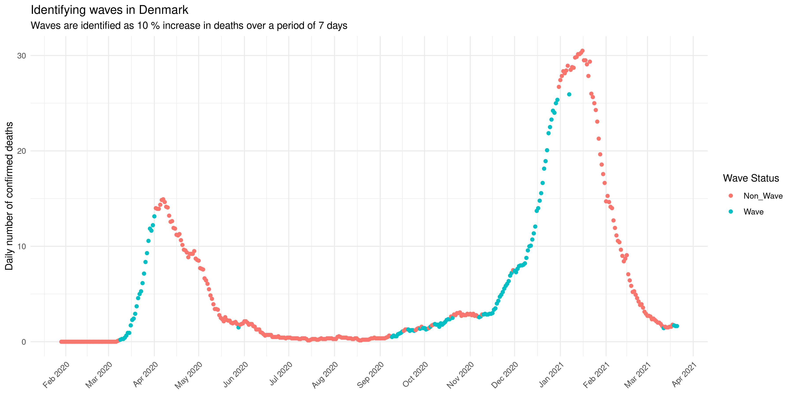
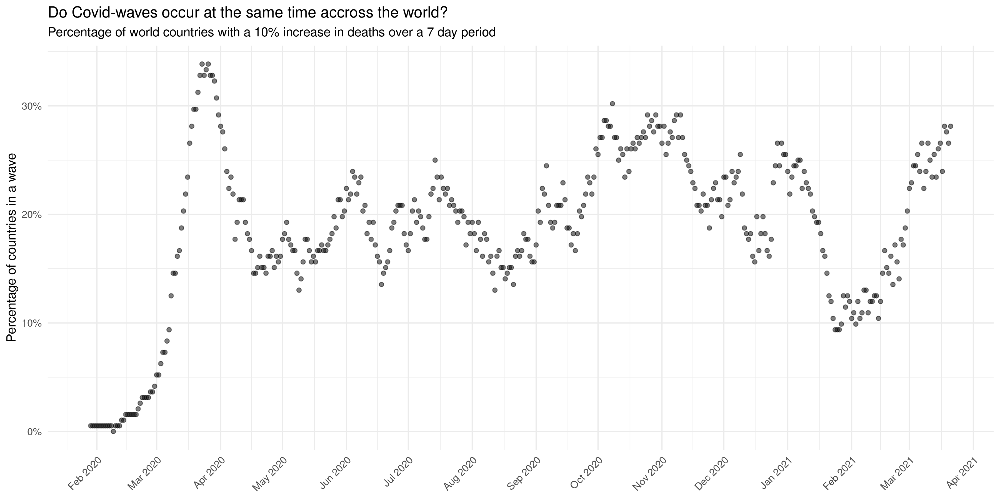
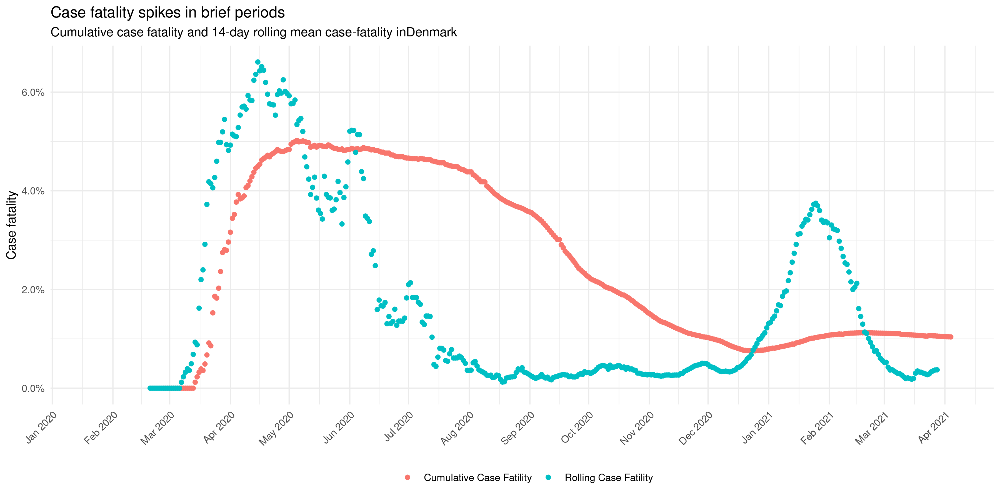

```{r setup, include=FALSE}
knitr::opts_chunk$set(echo = FALSE)
library(tidyverse)
```

## Results - Covid waves | What is covid wave?
- How does one define a covid wave?
```{r, echo = FALSE, out.width= "700px", fig.align = 'center'}

```

## Results - Covid waves | Are covid waves happening synchronized?
```{r, echo = FALSE, out.width= "700px", fig.align = 'center'}

```

## Results - Covid waves | What about for regions?
```{r, echo = FALSE, out.width= "700px", fig.align = 'center'}
knitr::include_graphics("../results/07_region_wave_trend.png")
```

## Results - Covid waves | Understanding Case-fatality
```{r, echo = FALSE, out.width= "700px", fig.align = 'center'}

```


