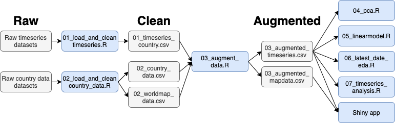
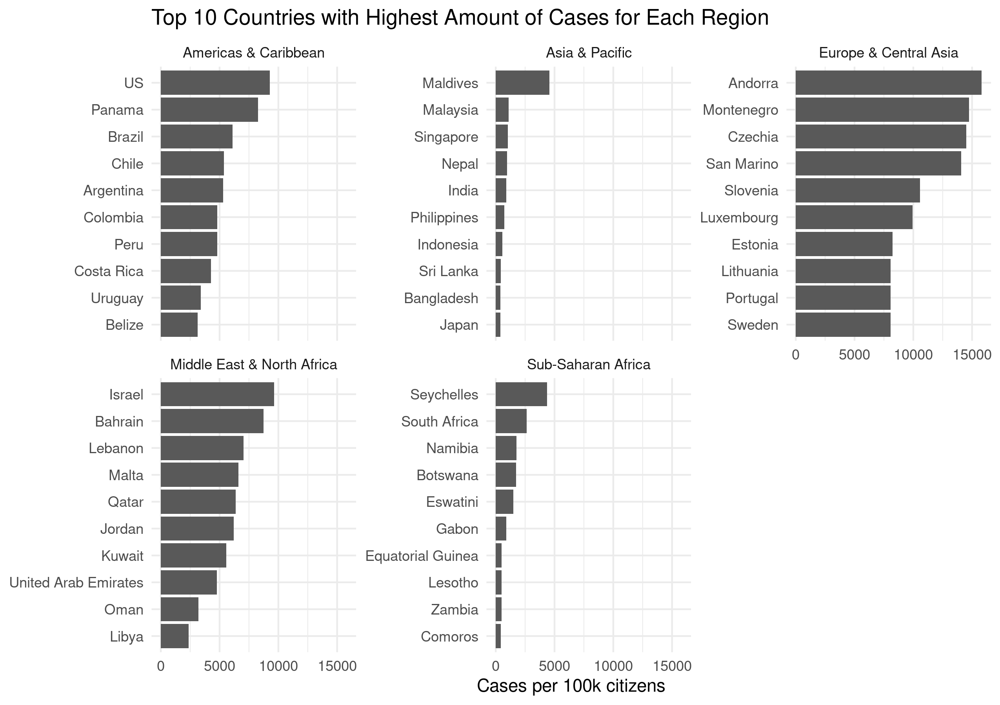
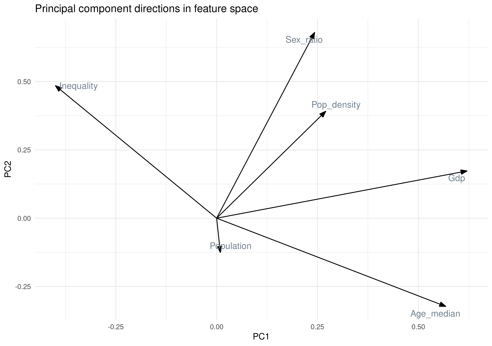
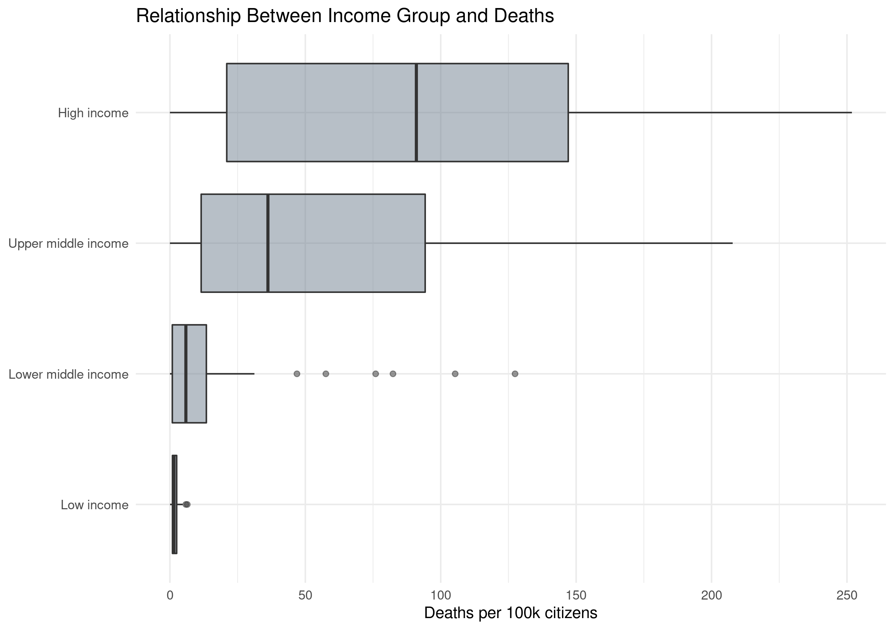

```{r setup, include=FALSE}
knitr::opts_chunk$set(echo = FALSE)
library(tidyverse)
```

## Introduction | Covid-19 and goals for the project

**Our goal** : Investigate how selected factors has correlated with
the spread of Covid-19

## Materials and method | Datasets and workflow
- Covid-19 data from the github repository of John Hopkins University 
- Demographic and social factors on a country basis from gapminder and worldbank

```{r, echo = FALSE, out.width= "700px", fig.align = 'center'}

```
 
## Materials and method | Cleaning

**Issues with dataset:**

- Timeseries data in very wide format
- Country names were not consistent over data sources
- Multiple files had to be combined

## Materials and method | Augmenting
Explain stuff about the augmenting

## Results | Countries with highest amount of cases per region

```{r, echo = FALSE, out.width= "700px", fig.align = 'center'}

```

## Results | PCA on continous demographic and social variables 
- <font size="4"> PC 1 explains differences in cases fairly well</font>
- <font size="4"> Some countries are outliers in this projection</font>

```{r, echo = FALSE, out.width= "600px", out.height= "300px", fig.align = 'center'}
knitr::include_graphics("../results/04_pca_projections_cases.png")
```

## Results | Investigate directions of PC1 and PC2
- <font size="4"> high projections on PC1 are developed countries</font>
- <font size="4"> PC2 is harder to interpret</font>
```{r, echo = FALSE, out.width= "700px", fig.align = 'center'}

```

## Results | Visualise correlation between income group and deaths
- <font size="4"> Deaths are not dependent on test strategy </font>
- <font size="4"> Clear difference in the number of deaths</font>

```{r, echo = FALSE, out.width= "700px", fig.align = 'center'}

```


## Covid-19 overview Shiny App

https://christianjohansen.shinyapps.io/covid-19_app/

## Discussion

## Conclusion ??
