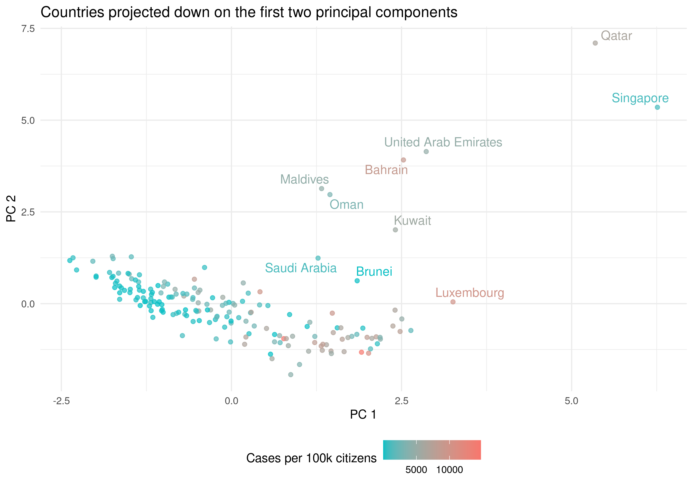

```{r setup, include=FALSE}
knitr::opts_chunk$set(echo = FALSE)
library(tidyverse)
```

## Results | Visualise correlation between income group and cases
- <font size="3"> different income groups have drastically different number of cases</font>
- <font size="3"> Primarily Americas and Europe has been hit hard</font>

```{r, echo = FALSE, out.width= "700px", fig.align = 'center'}
knitr::include_graphics("../results/06_cases_by_income_and_region.png")
```

## Results | PCA on numerical demographic and social variables 
- <font size="3"> PC 1 explains differences in cases fairly well</font>
- <font size="3"> Some countries are outliers in this projection</font>

```{r, echo = FALSE, out.width= "600px", out.height= "300px", fig.align = 'center'}

```

## Results | Investigate directions of PC1 and PC2
- <font size="3"> high projections on PC1 are developed countries</font>
- <font size="3"> PC2 is harder to interpret</font>
```{r, echo = FALSE, out.width= "700px", fig.align = 'center'}
knitr::include_graphics("../results/04_pca_directions.png")
```

## Covid-19 overview Shiny App

https://christianjohansen.shinyapps.io/covid-19_app/
