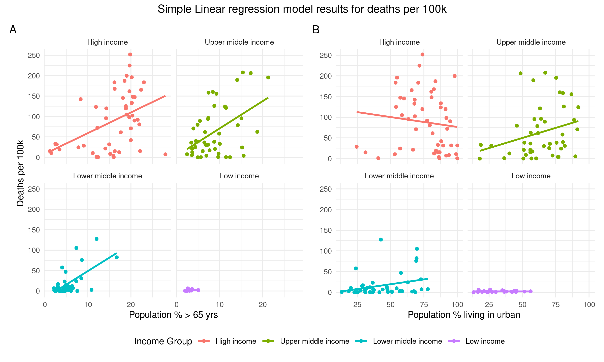
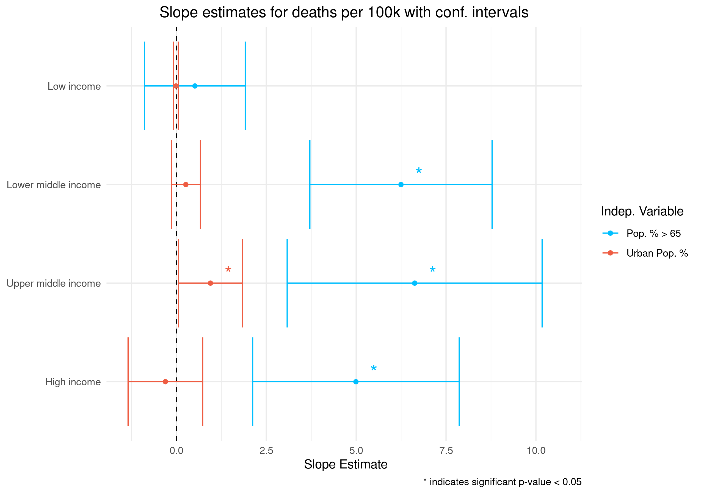
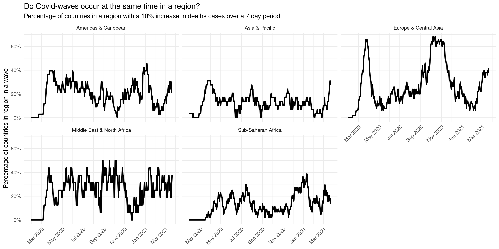

```{r setup, include=FALSE}
knitr::opts_chunk$set(echo = FALSE)
library(tidyverse)
```

## Introduction | Covid-19 and goals for the project

**Our goal** : Investigate how/if selected global socio-economic factors are correlated with the spread of Covid-19


```{r, echo = FALSE, out.width= "500px", fig.align = 'center'}
knitr::include_graphics("presentation_images/globecovid.jpg")
```
<font size="2"> photo from::https://sdbi.in/artificial-intelligence-and-big-data-to-control-covid-19"</font>

## Materials and methods | Datasets and workflow
- Covid-19 data from the github repository of John Hopkins University 
- Demographic and social factors on a country basis from gapminder and worldbank
- Latitude and longitude data for countries is from the "maps" package dataset

```{r, echo = FALSE, out.width= "700px", fig.align = 'center'}
knitr::include_graphics("presentation_images/workflow.png")
```
 
## Materials and method | Cleaning & Augmenting

**Cleaning: Issues with dataset:**

- <font size="4">Timeseries data in very wide format</font>
- <font size="4">Country names were not consistent over data sources</font>
- <font size="4">Multiple files had to be combined</font>
- <font size="4">Recovered are reported inconsistently</font>

**Augmentation:**

- <font size="4">Calculate cases, deaths, and recoveries per 100K citizens</font>
- <font size="4">Additional augmentations with rolling means and new cases per day</font>
- <font size="4">For shiny app: Join latitude and longitude data to the country level Covid data.</font>


## Materials and method | Data exploration and models

- Initial exploratory data analysis (eda)
- modelling:
  * PCA analysis: any trends, clusters, outliers in cases via countries and dependent variables?
  * 2 simple linear regressions: 
    + $y=\beta_0 + \beta_1 x_1+ \beta_2 x_2 + \epsilon$ grouped by Income category of country. 
    + $y=\beta_0 + \beta_1 x_1+ \beta_2 x_2 + \epsilon$ grouped by region
    
- Exploring Covid "waves" and case fatality

## Results - Exploratory Data Analysis

```{r, echo = FALSE, out.width="600px", out.height= "400px" , fig.align = 'center'}
knitr::include_graphics("../results/06_highest_cases_per_region.png")
```

## Results - Exploratory Data Analysis | Visualise correlation between income groups

```{r, echo = FALSE, out.width = "750px", out.height="400px", fig.align = 'center'}
knitr::include_graphics("../results/06_eda_slide_plot.png")
```


## Results - Models | PCA on continous demographic and social variables 
- <font size="4"> PC 1 explains differences in cases fairly well</font>
- <font size="4"> Some countries are outliers in this projection</font>

```{r, echo = FALSE, out.width = "600px", out.height = "350px" , fig.align = 'center'}
knitr::include_graphics("../results/04_pca_projections_&_directions.png")
```

## Results - Linear regression model
- <font size="4"> Deaths vs. (A) Pop % above 65 years and (B) Pop % living in urban areas. Grouped by income level. </font>

```{r, echo = FALSE,out.width = "600px", out.height = "400px" , fig.align = 'center'}

```

## Results - Linear regression model
- <font size="4"> Significant slope estiamtes for pop % > 65 with high income, pop % > 65 and pop % in urban with upper middle income, and pop % > 65 with lower middle income. </font>

```{r, echo = FALSE,out.width = "600px", out.height = "400px" , fig.align = 'center'}

```

## Results - Covid waves | What is covid wave?

How does one define a Covid-19 wave?

- Our approach:
  * X% increase over Y number of days

## Results - Covid waves | What is covid wave?

- A good Criteria
  * 10% increase over 7 number of days
  
```{r, echo = FALSE, out.width= "700px", fig.align = 'center'}
knitr::include_graphics("../results/07_country_wave_timeline.png")
```

## Results - Covid waves | Are Covid waves synchronized??
```{r, echo = FALSE, out.width= "700px", fig.align = 'center'}

```

## Covid-19 overview Shiny App

https://christianjohansen.shinyapps.io/covid-19_app/

```{r, echo = FALSE, out.width= "700px", fig.align = 'center'}
knitr::include_graphics("presentation_images/Shiny_pic.jpg")
```

## Discussion
- <font size="4"> 
- In general from eda and linear regression, data suggests that more developed countries are  hit "harder" by Covid-19. 
  * This could be due to less developed countries having a younger avg. age (higher general mortality rates), thus younger populations are less severely influenced by infection. Slide 9 figure we see that low income countries have smallest range in the percent of pop. above 65 yrs. 
  * However, here we have not considered for example:
    - Data quality/under reporting between countries. i.e. higher income countries will have better ability and excess to testing, thus more cases and deaths will be reported.
- Say something about what we see from between regions (maybe from Joen's results) </font>

 
## Conclusion: 

We want to point out that by looking at at correlations we are not inferring causation. 
In addition our linear model is not dealing with collinearity of features.

Overall we found that 

Moving forward __ 
